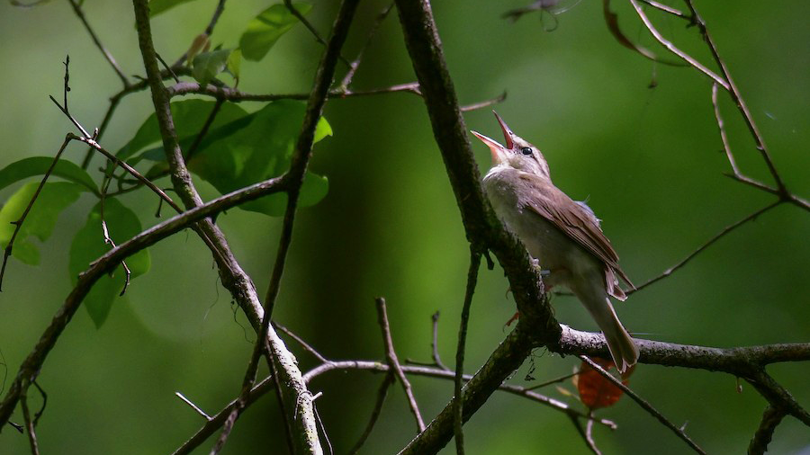

# (PART) Basic tutorial {-} 

# Tag object

In this basic tutorial, we run through all the steps of GeoPressureR using only pressure data, with the simple example of a [Swainson's Warbler](https://science.ebird.org/en/status-and-trends/species/swawar/abundance-map-weekly). This bird presents a short migration route, with only a few stopovers, making it fast to compute. 

{width=100%}


## Create tag

::: {.alert .alert-info role="alert"}
<h4 class="alert-heading mt-2"><strong>What is a `tag` object?</strong></h4>
A [tag](https://www.movebank.org/cms/movebank-content/mb-data-model) refers to a geolocator or datalogger device that can contain multiple sensors (e.g., pressure, light, acceleration). 

In GeoPressureR, `tag` is an essential object (i.e., a [S3 class](https://stat.ethz.ch/R-manual/R-devel/library/base/html/class.html)) modified at each step of the workflow: not only does it store the raw logger data, it also aggregates all the information needed to ultimately be able to model the bird's trajectory.
:::

The `tag` object is created based on the raw geolocator data

```{r 01-tag-create}
tag <- tag_create(
  id = "CB619",
  light_file = NULL,
  acceleration_file = NULL
)
```

The raw data for this tag id should be stored in `"./data/raw-tag/CB619/"` following the default structure described in [GeoPressureTemplate](https://github.com/Rafnuss/GeoPressureTemplate#project-structure-file_folder).

You can use the generic `plot()` function to visualize the tag data. 

```{r, warning = FALSE}
plot(tag, type = "pressure")
```

Depending on when you equipped the bird and when your tag started recording data, you will likely need to crop your data to specific dates. As [it is bad practice to modify your raw data](http://drivendata.github.io/cookiecutter-data-science/#data-is-immutable), we recommend using the `crop_start` and `crop_end` arguments in `tag_create()`.


## Label tag into stationary periods

Labelling tracks involves two steps: 

1. Label periods of flight, which, by extension will **define the STAtionary Periods** (called `stap` in the code), during which the bird is assumed to remain at the same location (+/- tens of kilometers) and same elevation level (+/- few meters)
2. **Discard pressure measurements** which should not be used to estimate position (due to, for example, sensor error, flight, minor/short changes in elevation level, etc.) 

::: {.alert .alert-danger role="alert"}
<h4 class="alert-heading mt-2"><strong>Important note</strong></h4>
Correctly labelling the track requires time and effort, but is key to accurately estimate the bird's position. 

As labelling relies on functions and tools presented later in the tutorial, we recommend first following the basic and advanced tutorials. After that, we strongly advise that you **read attentively the recommendations for this step provided in [labelling tracks]**.
:::


### Initialize and create the label .csv file

Use `tag_label_write()` to initiate the label (i.e., empty label) and create the label file to `"./data/tag-label/CB619.csv"`.

```{r}
tag_label_write(tag)
```


### Label manually on Trainset

Open <a href="https://trainset.raphaelnussbaumer.com/" target="_blank">https://trainset.raphaelnussbaumer.com/</a> and click on "Upload Tag Label" to load your .csv file. Instructions on how to label the file can be found in the dedicated chapter [labelling tracks]. Once you have finished, export the new `csv` file in the same folder `/data/tag-label/CB619-labeled.csv` (TRAINSET will automatically add `-labeled` in the name).

![*Print screen of the manual labelling of tag data in <a href="https://trainset.raphaelnussbaumer.com/">TRAINSET</a>. See [labelling tracks] for more information.*](assets/labelling-tracks-0.png){width=100%}

### Read labelled file

Read the exported file with `tag_label_read()` to update `tag$pressure` (and, when relevant, `tag$acceleration`), with a new `label` column.

```{r}
tag <- tag_label_read(tag)
kable(head(tag$pressure))
```

### Compute stationary periods

`tag_label_stap()` then creates the stationary periods based on these labels:

```{r, collapse=TRUE}
tag <- tag_label_stap(tag, quiet = TRUE)
kable(head(tag$stap))
```

Plotting the pressure timeseries of tag provides additional information:

```{r, warning = FALSE, collapse=TRUE}
plot(tag, type = "pressure", quiet = TRUE)
```

::: {.alert .alert-info role="alert"}
<h4 class="alert-heading mt-2"><strong>What is pre-processing?</strong></h4>
You might notice some discrepancies between the raw data (grey) and the **pre-processed pressure timeseries** of each stationary period (colored lines). 

The pre-processing aligns the raw timeseries data to the weather reanalysis pressure data by removing outliers and downscaling the resolution to 1hr falling on the exact hour. 

The black dots show the discarded pressure points (i.e., outliers), corresponding to bird vertical movement rather than natural variation of pressure.
::: 

Once you have created the tag label file (i.e., `CB619-labeled.csv`), you can use `tag_label()` directly to read the label and compute stationary periods.
