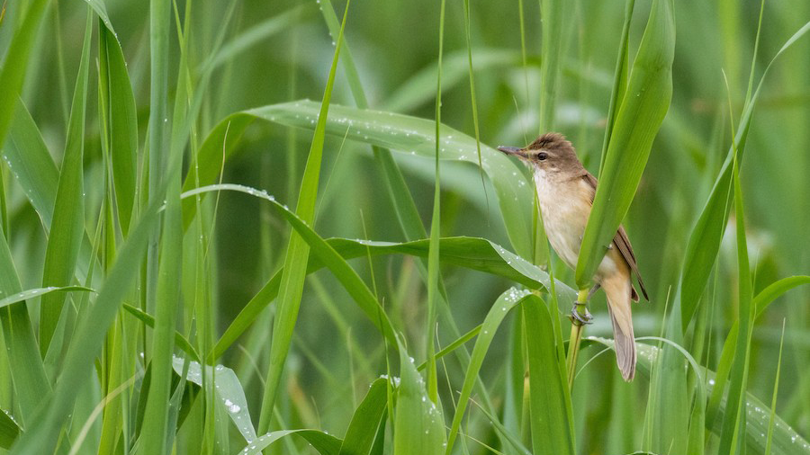

# (PART) Advanced tutorial {-} 

```{r 10-rm, echo=FALSE}
rm(list = ls())
```

# Light map

In the advanced tutorial, we will construct the same three outputs using the example of a Great Reed Warbler (18LX), this time including light and wind data. The workflow is very similar, and we will see how to run the same procedure much faster. 

{width=100%}

This first chapter focuses on constructing a likelihood map from light data. This step is optional in the workflow, and typically does not drastically change the result, but can be helpful to increase the computational efficiency during the creation of the graph. 

Here, we use an approach based on the threshold method and using a calibration of zenith angle (rather than time of sunrise). This approach is presented in more detail in <a href="https://besjournals.onlinelibrary.wiley.com/doi/10.1111/2041-210X.14043#mee314043-sec-0008-title" target="_blank">section 2.4 of Nussbaumer et al. (2023a)</a>

A more thorough introduction to geolocation with light data can be found in <a href="https://geolocationmanual.vogelwarte.ch/" target="_blank">the geolocation manual drafted by Vogelwarte</a> (Lisovski et al., [2020](https://besjournals.onlinelibrary.wiley.com/doi/10.1111/1365-2656.13036)). Note that other methods producing likelihood maps could also be used such as the ones presented in Basson et al. (<a href="https://besjournals.onlinelibrary.wiley.com/doi/full/10.1111/2041-210X.12555" target="_blank"2016</a>) or Bindoff et al. (<a href="https://besjournals.onlinelibrary.wiley.com/doi/full/10.1111/2041-210X.12953" target="_blank">2018</a>.

## Basic tutorial catch up

Before getting into light data, we first need to create, label, and set the map for the `tag` object. We essentially perform the same steps than in [tag object] and [pressure map] in just a few lines using the native pipe operator `|>`. Note that this assumes the labelling has already been done.

```{r 10-geopressure, cache = TRUE}
tag <- tag_create("18LX",
  crop_start = "2017-06-20",
  crop_end = "2018-05-02",
  quiet = T
) |>
  tag_label(quiet = T) |>
  tag_set_map(
    extent = c(-16, 23, 0, 50),
    scale = 4,
    known = data.frame(
      stap_id = 1,
      known_lat = 48.9,
      known_lon = 17.05
    )
  ) |>
  geopressure_map(quiet = T)
```

## Estimate twilights

We find the twilight (time of sunrise and sunset every day) with `twilight_create()`, which performs the same tasks as [`TwGeos::FindTwilight()`](https://rdrr.io/github/slisovski/TwGeos/man/findTwilights.html), but using a matrix representation. This approach is faster but less general (e.g., requires regularly spaced light data).

By default, the threshold of light (`twl_thr = NULL`) defining when the twilight occurs is computed as the first and last light of the day (i.e., `tag$light$vale>0`). The `twl_offset` parameter is used to center the night/day for the matrix representation of light. A good centering is necessary to compute the correct twilight.

```{r}
tag <- twilight_create(tag, twl_thr = NULL, twl_offset = NULL)
```

We can visualize the twilight and check the centering of the day. 

```{r}
plot(tag, type = "twilight")
```

Re-run `twilight_create` with a different `twl_offset` until the night/day is properly centered. 

The color of the dots indicates which stationary period the twilight belongs to, as defined with the tag label. This can be useful to distinguish outliers from a change in the bird position.  

## Manual labelling of twilight

Twilight outliers should be discarded from the analysis using Trainset <https://trainset.raphaelnussbaumer.com/>. 

Use `twilight_label_write` to generate the twilight label `csv` file.

```{r}
twilight_label_write(tag)
```

Click on "Upload Twilight Label" to customize the interface for twilight labelling. Similar to tag labelling, simply label the twilights to be ignored with the `"discard"` label.

::: {.alert .alert-info role="alert"}
<h4 class="alert-heading mt-2"><strong>How to pick out outliers?</strong></h4>
Twilight outliers can be picked out visually when they don't follow a smooth line. 

The color of the dots indicative of the stationary period can be helpful to pick out outliers from a change in the bird's position: while changes in twilight within a stationary period should be smooth, changes between positions are abrupt. 

Note that modifying the label of twilight to a different stationary period has no influence later on, as only `discard` labels are read with `twilight_label_read()`.

**Do not over-edit the calibration period!** The variability of twilight is important to build a calibration which adequately captures the range of uncertainty of a twilight. As it is easier to pick out outliers during long stationary periods than during shorter ones, there is a risk of having more variability during short stationary periods and thus biases in the estimated position.
:::

When you have finished labelling, export the file in the same folder keeping `-labeled` in the name (automatically added by Trainset). `twilight_label_read()` will automatically know which file to read.

```{r}
tag <- twilight_label_read(tag)
plot(tag, type = "twilight")
```

## Compute likelihood map

The computation of the light likelihood map for each stationary period is performed with `geolight_map()` and follows these three steps:

1. Perform a calibration of the zenith angle (i.e., the angle of the sun at sunrise and sunset) with a kernel density (see `stats::kernel()`). This requires knowing the position of the bird for a least one stationary period. This position should be specified with the `known` data.frame in `tag_set_map()`. 
2. Compute a likelihood map for each twilight. This step consists of computing, for each pixel of the map, the zenith angle and the corresponding probability using the calibrated kernel distribution.
3. Aggregate all likelihood maps of the same stationary period into a single map using a log-linear pooling. See [probability aggregation] for more information on log-linear pooling.

```{r 10-geolight-map}
tag <- geolight_map(tag, twl_calib_adjust = 1.4, quiet = TRUE) 
```

The `twl_calib_adjust` parameter adjusts the smoothness of the fit (see `stats::density()`). Because the zenith angle error model is fitted with data only at the calibration site, and we are using it for all locations of the bird's journey, it is safer to assume a broader/smoother distribution (`twl_calib_adjust > 1`). 

It is recommended to always check the calibration fit `tag$param$twl_calib` with

```{r}
barW <- median(diff(tag$param$twl_calib$x)) / 2
plot(tag$param$twl_calib)
rect(xleft = tag$param$twl_calib$x - barW, ybottom = 0, xright = tag$param$twl_calib$x + barW, ytop = tag$param$twl_calib$y, col = gray(0.5))
lines(tag$param$twl_calib, col = "red")
```

Finally, we can visualize the probability map for each stationary period:

```{r, warning=F}
plot(tag, type = "map_light")
```


::: {.alert .alert-danger role="alert" style="margin-top: 10px;"}
<h4 class="alert-heading mt-2"><strong>Light map vs pressure map?</strong></h4>

It is worth checking how the likelihood map of light and pressure compare before building the graph. They should always overlap. If this is not the case, the tag and/or twilight labelling needs to be adjusted.

```{r, warning=F}
plot(tag, type = "map")
```
::: 
