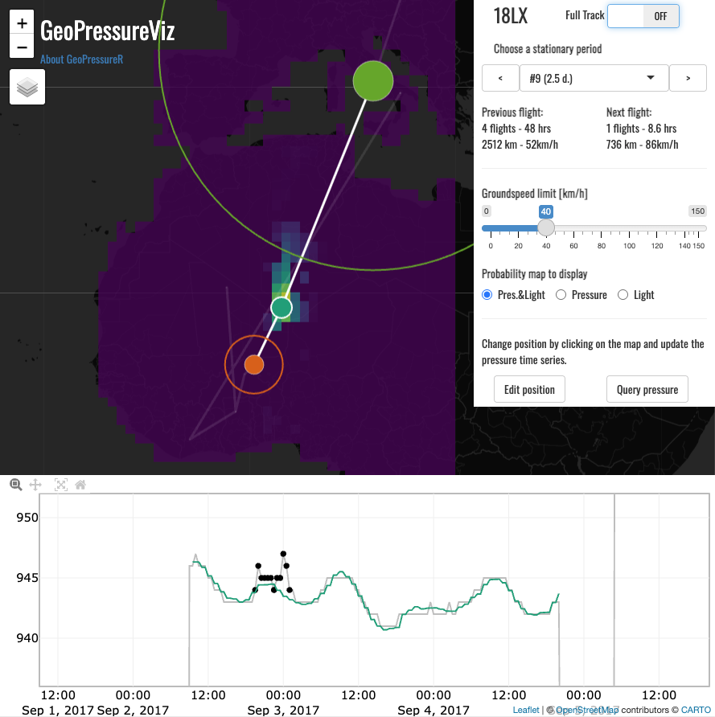

# GeoPressureViz

GeoPressureR includes the [shiny app](https://shiny.rstudio.com/) `GeoPressureViz` which helps you visualize the overall trajectory of the bird as well as each step-by-step move. Note that **this is a visualization tool only** and as such, it cannot be used to make changes to your data. It offers an useful tool to label your tag and provides a convinient platform to discuss the overall trajectory with collaborators.

<a href="https://rafnuss.shinyapps.io/GeoPressureViz/"></a>*Screenshot of the [GeoPressureViz demo](https://rafnuss.shinyapps.io/GeoPressureViz/) showing the estimated position at one stationary period of the Great Reed Warbler (18LX), based on (1) the pressure and light match (map colorscale and timeseries) and (2) potential flight distances from the previous and next stationary periods (circles).*

## Navigate GeoPressureViz

1.  Open [the demo for 18LX](https://rafnuss.shinyapps.io/GeoPressureViz/)

2.  The app has three panels:

    1.  The map showing the trajectory of the bird. The size of the circles indicates the duration of the stopover (hover over them to get more info).

    2.  The bottom panel shows the `pressurepath` of the trajectory which needs to be computed before. The grey line is the raw data (`pressurepath$pressure_tag`), the black dots are pressure points labelled as outliers, and colored lines are the normalized pressure at the best match location (i.e., `pressurepath$pressure_era5_norm`). The color matches the circles on the map.

    3.  The side panel provides key information as well as tools to navigate the app.

3.  The "Minimum duration" input allows to filter out short stationary period on the map, similarly to `include_min_duration` in `tag_set_map()`.

4.  Toggle the "Full Track" button to move to the stationary period view.

5.  Navigate from one stationary period to the next using the previous/next button or dropdown. The pressure timeserie will update to zoom exactly on this stationary period. The color of the timeserie informs you on which dots on the map is the current stationary period, the two others begin the previous and next one.

6.  The circles indicates the distance from and to the previous and next stationary period location based on the speed slider on the side panel (default is 40km/h).

7.  Depending on which maps are availble, you can choose to display the probability map of pressure `tag$map_pressure`, light `tag$map_light`, their product or the marginal.

8.  Because some location of the most likely path can be completely off, it might be helpful to change temporarily their location to check the coherence of distance with the next/previous stationary period. Use the button "Start Editing" to do that. Every time you will click on the map, it will update the position. Once you're happy with the position, you can click again the button to disable the editing mode.

9.  Finally, you can also check the pressure timeserie with the new position that you've edited with the button "Query pressure". This runs `geopressure_timeseries()` on the background, so it will be slow (especially for long stationary period).


## Run GeoPressureViz

The visualization can be started with your track using `geopressureviz()`. 

```{r, eval = F}
load("./data/interim/18LX.RData")
path_modified <- geopressureviz(
  tag = tag, # required
  pressurepath = pressurepath, # optional
  marginal = marginal, # optional
)
```

If you the data are stored in `"./data/interim/18LX.RData"`, you can use directly

```{r, eval = F}
geopressureviz("18LX")
```


Note that if you close the app from the browser, the function returns the path that you have interactively created `path_modified`.
