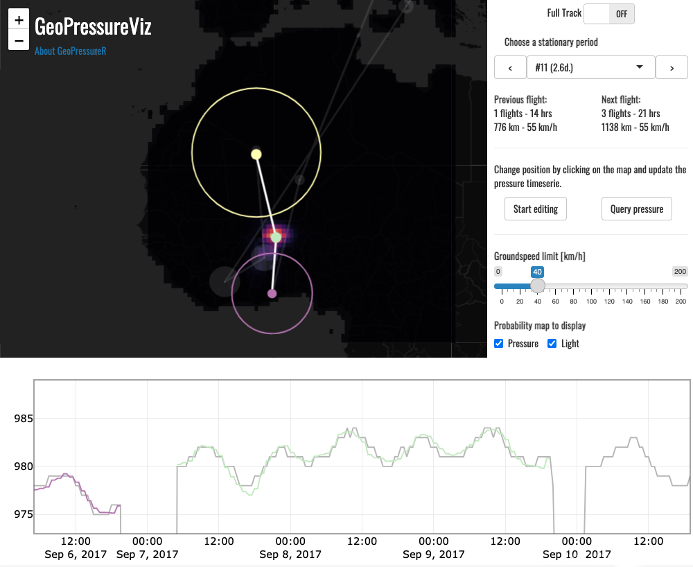

# GeoPressureViz

GeoPressureR includes a [Shiny app](https://shiny.rstudio.com/) called `GeoPressureViz` which helps you visualize the overall trajectory of the bird as well as each step-by-step move. Note that **this is a visualization tool only** and as such, it cannot be used to make changes to your data. Its main purpose is to check any labelling issue. It also offers a more intuitive visualisation of how your bird is moving, and can be a useful platform to discuss the overall trajectory with collaborators.

<a href="https://rafnuss.shinyapps.io/GeoPressureViz/"></a>*Screenshot of the [GeoPressureViz demo](https://rafnuss.shinyapps.io/GeoPressureViz/) showing the estimated position at one stationary period of the Great Reed Warbler (18LX), based on (1) the pressure and light match (map colorscale and timeseries) and (2) potential flight distances from the previous and next stationary periods (circles).*

## Navigate GeoPressureViz

1.  Open [the demo for 18LX](https://rafnuss.shinyapps.io/GeoPressureViz/)

2.  The app has three panels:

    1.  The map showing the trajectory of the bird. The size of the circles indicates the duration of the stopover (hover over them to get more info).

    2.  The bottom panel showing the pressure timeseries. The grey line is the raw data (`tag$pressure`), the black dots are pressure points labelled as outliers, and colored lines are the normalized pressure at the best match location (i.e., `pressurepath$pressure_0_norm`). The color matches the circles on the map.

    3.  The side panel provides key information as well as tools to navigate the app.

3.  A central parameter to play with carefully is the "Minimum duration". This filters the entire dataset and replots the map and figure to select only stopovers of the given duration or longer. Try playing with this value - note that you may have to wait a little for the figure to update. As shorter stationary periods are less certain, their position is often wrong. That's ok for now.

4.  Toggle the "Full Track" button to move to the stationary period view. The side panel will change and provides you with more options.

5.  Navigate from one stationary period to the next using the dropdown or previous/next button. Except from the first stap, three dots, two lines and two circles will appear on the map, and the pressure timeserie will update to zoom exactly on this stationary period. The color of the timeserie informs you on which dots on the map is the current stationary period, the two others begin the previous and next one.

6.  The circles indicates the distance from and to the previous and last stationary period location based on the speed slider on the side panel (default if 40km/h). You can edit the speed to see how this impact the distances.

7.  You can choose to display the probability map of pressure (`pressure_prob`) , light (`light_prob`) or combined (`static_prob`).

8.  Because some location of the most likely path can be completely off (hence the need for a trajectory model), it might be helpful to change temporarily their location to check the coherence of distance with the next/previous stationary period. Use the button "Start Editing" to do that. Every time you will click on the map, it will update the position. Once you're happy with the position, you can click again the button to disable the editing mode.

9.  Finally, you can also check the pressure timeserie with the new position that you've edited with the button "Query pressure". This runs `geopressure_ts()` on the background, so it will be slow (especially for long stationary period). This feature is quite unstable, so use carefully, and be aware that you might have to restart the app if it crashes (submit [an issue](https://github.com/Rafnuss/GeoPressureR/issues/new) with reproducible example).


## Run GeoPressureViz

To run the visualization, use the `geopressureviz()` function

```{r, eval = F}
path_modified <- geopressureviz(
  tag = tag, # required
  pressurepath = pressurepath, # optional
  marginal = marginal, # optional
)
```

Note that if you close the app from the browser, it should return the path that you have interactively created as a data.frame.
