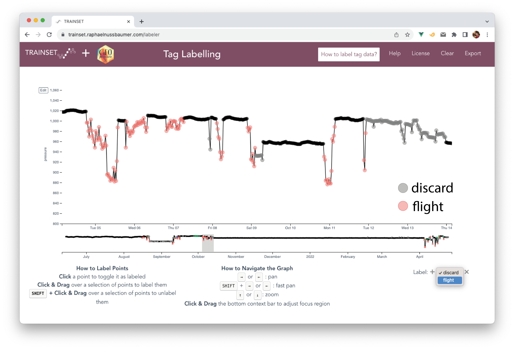
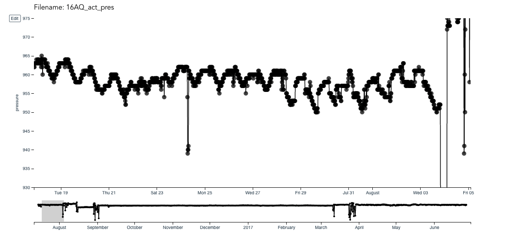
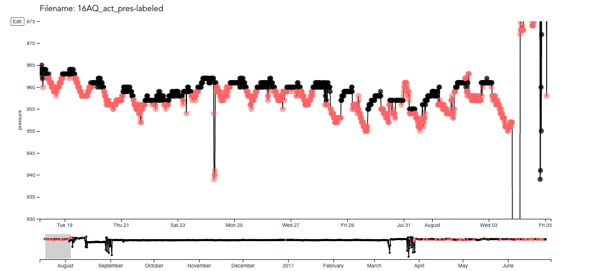
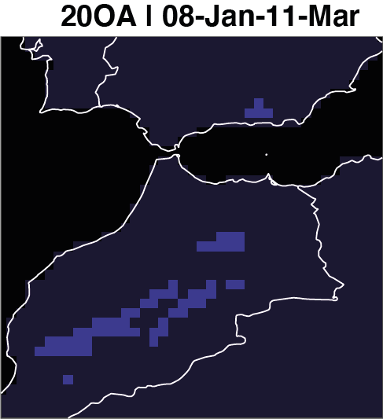

# Labelling tracks

In this last chapter, we explore how to label your tag and provide tips to make the exercise more efficient. This chapter assumes that you are familiar of the overall process of GeoPressureR presented in the basic tutorial, as well as the concept of pressurepath and the use of geopressureviz.

## Labelling principles

Labelling (manually) your tracks is imperative because geopressure requires highly precise and well-defined pressure timeseries of a fixed/constant location both in horizontal (geographical: +/- 10-50km) and vertical (altitude: +/- 2m).  

The procedure involves labelling each datapoint (1) when the bird is in active migratory flight with label `flight` and (2) identifying pressure datapoints to be discarded from the matching exercise with label `discard`. The overall objectif is to be able to create timeseries of pressure for each stationary periods where the bird can be assumed to be at the same location and elevation level during the entire period. 

1. **Labelling `flight` defines stationary periods and flight duration**. A stationary periods is defined by period during which the bird is considered static relative to the size of the grid (~10-50km). The start and end of the stationary period is then used to define the pressure timeseries to be matched. Since flight duration is the key input in the movement model, having an accurate flight duration is critical to correctly estimate the distance traveled by the bird between two stationary periods.
 
2. **Labelling `discard` allows to eliminate vertical (altitudinal) movement of the bird.** The pressure timeseries matching algorithm is sensitive to pressure variation of a few hPa, such that even a altitudinal movement of a couple of meters can throw off the estimation map for short stationary period. Since the reanalysis data to be matched is provided at a single pressure level, we must discard all data points from the geolocator pressure data corresponding to a different elevation.

Each species' migration behaviour is so specific that **manual editing remains the fastest option**. Indeed, small movement corresponding to small change of pressure and high activity can correspond to local movement (birds essentially stays at the same location) or slow migration. Expertise on your bird expected migration style will be essential to correctly label your tracks.

**Manual editing also provides a sense of what the bird is doing**. You will learn how the bird is moving (e.g. long continuous high altitude flight, short flights over multiple days, alternation between short migration flights and stopovers, etc.). It also provides a sense of the uncertainty of your classification, which is useful to understand and interpret your results. 


## With or without acceleration data

Acceleration data can significantly improve our understanding of bird movement. One of its main strength is to refine short stationary period or flight at the end of the night when bird tend to flight low. In addition, acceleration is typically recorded at a higher temporal resolution (5min) which can refine flight duration and thus the movement model when building the trajectory.

<div class="alert alert-alert" role="alert">
<h4 class="alert-heading mt-2"><strong>Which timeseries de label?</strong></h4>
When acceleration data is available, label `flight` on the acceleration timeseries and `discard` on the pressure timeseries. In absence of acceleration data, both labels are done on the pressure timeseries.
</div>


Let's see and example with 18LX which has acceleration data.

```{r}
tag <- tag_create("18LX", crop_start = "2017-06-20", crop_end = "2018-05-02")
```

Acceleration can be used to initialize the flight label automatically. `tag_label_auto` first classify low and high activities using a [k-mean clustering](https://en.wikipedia.org/wiki/K-means_clustering) with 2 groups. It then identify and label long periods of high activities (e.g., lasting more than 30 minutes) as flight.

```{r}
tag <- tag_label_auto(tag, min_duration = 30)
plot(tag, type = "acceleration")
```

More classifications method are describe in the [PALMr manual](https://kiranlda.github.io/tagLrManual/index.html).


## Elevation period

It is common for bird to change elevation level within the same stationary period. 
Resolution of interest is max 10-25km, bird performed movement withing this area which can result in drastic change in pressure due to elevaiton while temporal variation are the same. 
Particularly in area with elevation change, birds might be moving daily, or using different site within the same general area. 

To help circuvint such behavirou while preserving a max of data to be match with ERA5, you can label difference elevation level with TRAINSET. By default, no label could be assumed to be `"elev_1"`. You can then add a new elevation level by clicking the + sign on the bottm right of the screen and label specific period (doesn't have to be continous). 

*Illustration*


## The process (remove?)

Labelling is an **iterative process** where you will need to check the validity of the pressure timeseries at stationary period against the reanalysis data (more on this later). You can expect to spend between 30sec to 10-30min per track depending on the species' migrating complexity (acceleration data, number of flight, altitude of flight etc...).

The `tag_label()` functions can be used to guide you through the process, but for pedagogical reason, here are the steps to be performed:

```{r, eval = F}
# 1. Create the csv label file `"data/tag-label/18LX.csv"`
tag_label_write(tag)

# 2. Edit csv file on trainset 
# *on TRAINSET*

# 3. Export csv file `"data/tag-label/18LX-labeled.csv"`
# *on TRAINSET*

# 4. Read exported label file
tag <- tag_label_read(tag)

# 5. Compute stationary period data.frame tag$stap
tag <- tag_label_stap(tag)
```

Any subsequent modification of the csv file `"data/tag-label/18LX-labeled.csv"` can be directly process (step 4-5) using `tag_label()`.


## Introduction to TRAINSET

We are suggesting to use TRAINSET, a web based graphical tool for labelling time series. 

<div class="alert alert-info" role="alert">
We developed a  customized version of TRAINSET for labeling tag and twilight data: [https://trainset.raphaelnussbaumer.com/](https://trainset.raphaelnussbaumer.com/) ([Github repository](https://github.com/Rafnuss/trainset))
The original TRAINSET ([https://trainset.geocene.com/](https://trainset.geocene.com/)) will not offer the right service for the labeling. 
</div>

The tool interface is quite intuitive. Start by uploading your .csv file (e.g., `data/tag-label/18LX.csv`) using the "Upload Tag Label" button

{width=100%}


A few tips

- **Keyboard shortcuts** can considerably speed up navigation (zoom in/out, move left/right) and labelling (add/remove a label), specifically with `SHIFT`.
- Because of the large number of datapoints, keeping a narrow temporal window will avoid your browser from becoming slow or irresponsive.
- Change the `Active Seties` and `Reference Series` depending on what you are labelling but use **both timeseries at the same time** to figure out what the bird might be doing.
- Adapt with the **y-axis range** to each stationary period to properly see the small (but essential) pressure variations which are not visible in the full view


## Four steps to check labelling

To improve and evaluate the quality of your labelling, you can use these four tests.

### Check 1: Duration of stationary periods and flights

The first test consists in checking the duration of flights and stationary periods. This is systematically checked when computing stationary periods and a message will give you feedback on where to find these potential errors.

```{r}
tag <- tag_label(tag, "data/tag-label/18LX-labeled-v1.csv")
```

Here, I used directly the label produced by `tag_label_auto()` without making any edits on TRAINSET. The errors in most of these cases is cut a flight into two because the bird was inactive during a few datapoint. Going back to TRAINSET, this is easily corrected by cleaning up flight. I can be tricky to know what is a flight, we'll talk more about that later

```{r}
tag <- tag_label(tag, "data/tag-label/18LX-labeled-v2.csv")
```

Depending on your specific species and desire level of precision, you may want to keep some of the short flight and/or short stationary periods.

### Check 2: Pressure timeseries

In the second check, we visually inspect that the pressure timeseries of each stationary period are (1) correctly groups and (2) do not includes pressure outlier (e.g., altitudinal movement). We can use the generic `plot()` function with a `tag` object to display the timeserie and print messages on the quality of the resulting pressure timeseries of each stationary periods. 


Note that the plot shows the preprocess data (see `geopressure_map_preprocess()`), which is designed to be efficiently match against ERA-5 data: remove flight and outliar, as well as downscaling to 1 hours. 

```{r}
plot(tag, type = "pressure")
```

Ploting this figure with [Plotly](https://plotly.com/r/) allows you to zoom-in and pan to check the timeseries of each stationary manually. Make sure each stationary period does not include any pressure measurement from a flight or a vertical movement by labeling the pressure timeseries as `discard` on TRAINSET.

### Check 3: Pressure timeseries match

At this stage we should have a label file in a roughly good shape. The next checks will increase in complexity and computational cost but will allow to nicely fine-tune the final trajectory. The general scheme for the following check will be to perform the following steps iteratively:

1. Estimate our current best guest of the trajectory (i.e. a `path`) 
2. Compute the ERA-5 pressure on this path (i.e., `pressurepath`), 
3. Compare the ERA-5 pressure to the tag pressure
4. Refine the label: (1) label outliar, (2) merge or split stationary periods, (3) use elevation level

Check 3 will use the light and pressure likelihood map to estimate the path. 

First, let's compute these maps on a coarse map (e.g. `scale = 1`) and low precision of mismatch (e.g. `max_sample = 50`) to minimize the computational cost.

```{r, cache = T, message=F, results='hide'}
tag <- tag_create("18LX", crop_start = "2017-06-20", crop_end = "2018-05-02") |> 
  tag_label("data/tag-label/18LX-labeled-v3.csv") |> 
  tag_geostap(
    extent = c(-16, 23, 0, 50),
    scale = 1,
    known = data.frame(
      stap_id = 1, 
      known_lat = 48.9,
      known_lon = 17.05
      )
  ) |> # Define a coarse grid during the labeling
  geopressure_map(max_sample = 50) # compute the likelihood maps for each stationary period with low precision

tag <- tag |> 
  twilight_create() |>
  twilight_label_read() |>
  geolight_map()
```

From these map, we can compute the path that goes through the position with the higher probability at each stationary periods. Note that this path is likely not realistic as no movementmen model has been included (ie. the bird can flight as far as it want), and that's ok, we don't really want to assume realistic path, just to see what pressure can tell us without assuming anything. 

```{r, warning = FALSE}
path <- tag2path(tag)
```

Using this path, we can now retrieve the era5 pressure along this path using `pressurepath_create`

```{r, cache=T, message=F, results='hide'}
pressurepath <- pressurepath_create(tag, path = path)
```

Using `plot_pressurepath()`, we can visualize the pressure timeseries of the tag (grey) and of the pressurepath. Zoom on each stationary period to get a better sence of the likely natural variation of pressure. 

```{r}
plot_pressurepath(pressurepath)
```

<div class="alert alert-info" role="alert">
<h4 class="alert-heading mt-2"><strong>What is an outliar?</strong></h4>
The conversion of the means squared error (MSE) into a likelihood performed by `geopressure_map_likelihood()` assumes that the error distribution of pressure is normally distributed. This has important consequences in that it will not perform well in presence of large error, typically resulting in a map with a single possible pixels. 

Assuming this normal distribution also allows us to define more formally a test for outliar: any value further than +/- 3 standard deviation. This standard deviation is defined by the parameter `sd`, with a default value of 1. 

`plot_pressurepath()` displays with an orange triangle any outliar value for you to check manually. 
</div>

Even if not marked as ouliar, you can use this figure to identify any periods where there is a mismatch between the geolocator and ERA5, usually indicative of altitudinal movement of the bird. Depending on the situation, there are multiple way of labelling this mismatch. 

- In the easier case, the bird simply flew within the same stationary site (<10-50km) for a short time and came back to the same location. In such case, you can simply label out the pressure timeserie during the temporary change of altitude. 
- If the bird changed altitude but never came back to the same elevation, there a different way of solving this. You can either considered that the new altitude is a new stationary period and label the activity data. Otherwise, you can label out the pressure timeserie of the shorter period. It is essential that the resulting pressure timeserie matches the ERA5 pressure at everywhere. Matches are usually better for the longer periods. Looking at the activity data during the same period can also help understand what the bird is doing.
- If the bird change back and forth between two elevation level, use `elev_x` label. 

As a general guidine, it is better to remove a bit more for long stationary period to get better estimation of the position.  

Iterative process, remove a bit and then see if the position improve. 

Need to keep in mind that some position might be completly off.

Once you're happy with your new labels, we need to update tag. I order to avoid having to run `geopressure_map()` and `pressurepath_create()` for the full timeserie, `tag_upate()` and `pressurepath_upate()` helps you to only update the stationary periods that have changed. 

```{r, cache=T, message=F, results='hide'}
tag <- tag_update(tag, file = "data/tag-label/18LX-labeled-v4.csv")
pressurepath <- pressurepath_update(pressurepath, tag)
```

### Check 4: Histogram of pressure error

In addition to the pressure timeseries, you should also look at the histogram of the pressure error (geolocator-ERA5). 

- For long stationary periods (over 5 days), you want to check that there is a single [mode](https://en.wikipedia.org/wiki/Mode_(statistics)) in your distribution. Two modes indicate that the bird is spending time at two different altitudes. This is usual when birds have a day site and a night roost at different elevations. Use `elev_x` label.
- The red vertical dotted line indicates +/-3 sd which can be helpful to identify when outliar are present (identical to the orange dot in the timesrie plot).
- Stationary period which have an empirical sd greater than the one used (`sd`), are highlighted in red. The likelihood map for these stationary period might not be correct. 


```{r}
plot_pressurepath(pressurepath, type = "hist", plot_plotly = FALSE)
```

<div class="alert alert-info" role="alert">
<h4 class="alert-heading mt-2"><strong>How to calibrate of sd?</strong></h4>
You might also want to check the spread of the distribution. This value can guide you in setting the standard deviation parameter `s` in `geopressure_prob_map()`.
In this, a `sd=1` (default value) seems adequate, maybe 0.8-0.9 would still be ok
</div>


### Check 5: GeoPressureViz

Another important tool to be using while checking the label with pressurepath is using the shiny app GeoPressureViz. This can be used in parrallel to checks 3-5.

The chapter geopressureviz gives a nice introduction to it and how to use it.

```{r, eval = F}
geopressureviz(
  tag = tag, # required
  pressurepath = pressurepath, # optional
)
```

You are essentially checking the same issue as mentioned above, but now using the liekely distance between stationary period, you check the pressure of a realistic path. 

<div class="alert alert-warning" role="alert">
<h4 class="alert-heading mt-2"><strong>Can you "draw" the trajectory?</strong></h4>
A very good test before building the graph which is a bit more of black box, is to see if you can manually roughly draw a path from the combinaison of the pressure/light map and the flight duration. You should be able to move the position of the trajectory such that the flight distance are realistic and positing ar likely according to the likelihood maps. If not, check your label, if so, you can move to build your graph!
Remember that bird can have a much larger groundspeed when wind is blowing their way (up to 150km/h for instance). These are usually only for very long flight, but in such case, the circle on geopressureviz will look too small, but that's ok. 
</div>

In geopressureviz, use the "start editing" to modify the path to something likely based on long stationary period. Query pressure at the new edited location to figure out potential vertical movement during these short stationary period which needs to be labeled. 

### Check 6: Most likely path

Labeling shoudld really by checked at almost each fo the step of the workflow. It is recommended to always check your most likely path with the same checked performed in 3-5. 

```{r, cache=T, message=F, results='hide'}
# Update tag and pressurepath
tag <- tag_update(tag, file = "data/tag-label/18LX-labeled.csv")

# Build graph, add wing, add movement
graph <- graph_create(tag) |>
  graph_add_wind(tag$pressure) |>
  graph_add_movement(bird = bird_create("Acrocephalus arundinaceus"))

# Compute most likely path
path_most_likely <- graph_most_likely(graph)

# Compute the corresponding pressurepath
pressurepath <- pressurepath_create(tag, path = path_most_likely)
```

The same figure can be checked again and hopefully everythin matches really well now! If not, it is important to troubleshoot!

```{r}
plot_pressurepath(pressurepath)
plot_pressurepath(pressurepath, type = "hist", plot_plotly = FALSE)
```


## Common challenges and tips to address them

In the following section, we use examples to illustrate common challenges that may be encountered during manual editing, and offer suggestions on how to address them. 


### Outliers during flights due to low bird activity

During a flight, single activity measurements can display low activity due to e.g. short gliding flights with no flapping. The automatic labelling of activity with the KNN classifier may mislabel these points as stationary periods, as illustrated in the example below for the night of the 31st of August. A single mislabeled point can incorrectly split the flight into multiple short flights. This error is highlighted with Test #1 described above. However, birds may also display lower activity at the beginning or end of their flight, which is often miss-classified, as illustrated in all three nights in the example below and would not be picked up by Test #1.

{width=100%}

However, if the low activity happens well before the bird reaches the ground, as illustrated in the example below, the low pressure measurement of flight will be included in the stationary period. These error can sometimes be pick-up in Test #2. Yet this is worth checking all flights activity and assess on a case-by-case basis whether this such datapoints should be included in the flight or not. 

{width=100%}

### Importance of zooming in before editing outliers

Anomalies in a pressure timeseries might not be obvious at first sight.

{width=100%}

Zooming in to narrower pressure range helps to understand what is happening. In this example, we have a Tawny Pipit breeding near a mine site with a rough topography. While breeding, it looks like it is staying at a relatively constant elevation, but the sudden drop in pressure towards the end indicates that the bird has changed altitude.

{width=100%}

In such cases, the aim is to discard all pressure datapoints recorded while the bird was at a different altitude. It may not always be obvious to distinguish temporal variation of pressure from when the bird actually changes altitude. We suggest keeping only the datapoints that you are confident with (here, the first part of the timeseries only) and running Test #3.  

{width=100%}

With a long timeseries such as this one, Test #3 will easily pick up the right location and the timeseries that you want to match. You can simply de-select the datapoints at the end of your timeseries that fit the ERA5 green line. For shorter timeseries, you might need several iterations to pick up the correct match.

### Short stationary halts between flights

Interpreting bird behaviour and defining stationary periods can be difficult, for example when birds extend their migration into the day but with lower intensity, such that the end of flight is not clear. 

{width=100%}

In other cases, the bird stops for a couple of hours and then seems to be active again. This could be low-intensity migratory movement, a short break followed by more migratory flight, or landing at the stopover location, but relocating early morning with the light.

{width=100%}

The question is whether to label these halts as stationary periods or not. 

Referring to the pressure timeseries can help assess whether the bird changes location. For example, if the low activity is followed by high activity accompanied by pressure change, we can consider that the bird then changed location, and label the low activity as a stationary period. 

However, the bird may also land and then complete local flights within its stopover location (with very little pressure variation), in which case we want to avoid creating two different stationary periods. 

Test #3 helps ensure that no local vertical movements took place. 

{width=100%}

###	Mountainous species
Mountainous species display very specific behaviour with regular altitudinal changes. 

This is very clear with the Ring Ouzel’s timeseries, which displays daily occurring movements, though not regular enough to make the process automatic, and sometimes changing in altitude. At this scale, it is difficult to assess the temporal variation of pressure, both the 790hPa and 900hPa pressure level might work, such that it is difficult to know which points to discard.

{width=100%}
At this point it can help to zoom out on the time axis to see whether a certain elevation seems most common. Then proceed iteratively to keep only the datapoints at the same elevation. Test #4 is useful to ensure you did not forget any points.

{width=100%}

{width=100%}

The Eurasian Hoopoe presents more of a challenge as it moves continuously throughout the day, showing a more sinosoidal pattern. 

{width=100%}
This is the most challenging case as distinguishing temporal variation from altitudinal change is difficult. 

{width=100%}
Several iterations should lead to a relatively smooth pressure timeseries. Note that in order to estimate the uncertainty correctly for such cases, the standard deviation `s` should be increased. Thankfully, this behaviour is restricted to its breeding ground. 

{width=100%}

In some cases, finding a single timeseries is impossible, such as for the wintering site of this Ring Ouzel, never returning to the same elevation. In such cases, we discard the entire timeseries and use only the mask of absolute pressure values. 

{width=100%}

Luckily, by definition mountainous species live in specific areas, which restricts possible locations. In this case, based on previous stationary periods we can establish that the bird was in Morocco, and with such low pressure (i.e. high elevation), only the Atlas mountains fit the pressure mask.

{width=50%}

## Examples

???
