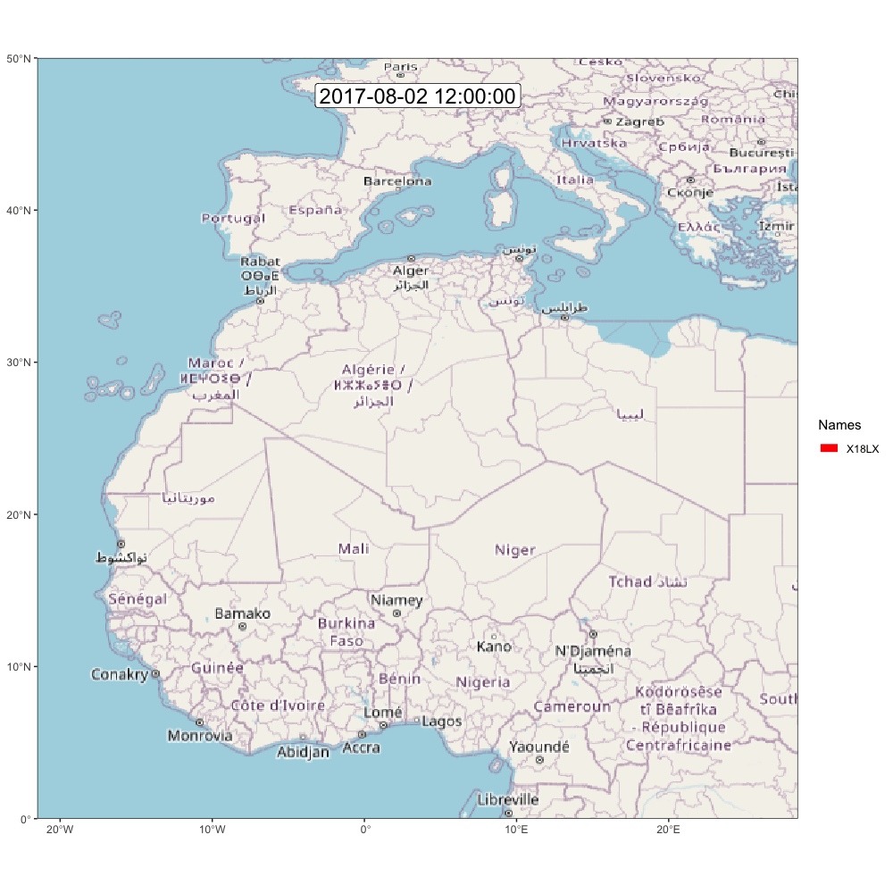

# Export and Visual

In this extra chapter we will see how to create some additional figure and export the data

```{r, message=FALSE}
load("./data/interim/18LX.Rdata")
```

## Export to open format

In addition to saving the graph object, you might want to export the three products. We recommend storing these in `"./data/processed"` in a standard format which can be opened with other softwares. 

For all data.frame format (e.g., `stap`, `pressurepath`, `path_most_likely` etc...), a `.csv` is the best option.

### Stationary period

We can add some additional information on stationary periods such as altitude metric
```{r, warning=F}
altitude <- pressurepath2altitude(pressurepath)
```

```{r, warning=F}
# Compute summury stat of altitude, grouping by stap_id
stap <- merge(
  tag$stap,
  data.frame(
    stap_id = sapply(split(altitude$stap_id, altitude$stap_id), median),
    alt_mean = sapply(split(altitude$altitude, altitude$stap_id), \(x) round(mean(x), 1)),
    alt_med = sapply(split(altitude$altitude, altitude$stap_id), \(x) round(median(x), 1)),
    alt_min = sapply(split(altitude$altitude, altitude$stap_id), \(x) round(min(x), 1)),
    alt_max = sapply(split(altitude$altitude, altitude$stap_id), \(x) round(max(x), 1))
  )
)

# Duration can also be computed with
stap$duration <- round(stap2duration(tag$stap),2)

write.csv(stap, glue::glue("./data/processed/{tag$param$id}/stap.csv"), row.names = FALSE)
```

Note that the most likely path contains all the information from `stap` and could be used instead if you wand to have the best estimate of the coordinate of the stationar periods.

### Flights

Similarly, flight can also be exported.

```{r, warning=F}
altitude_f <- altitude[altitude$stap_id == 0, ]
flight <- merge(
  stap2flight(tag$stap),
  data.frame(
    stap_s = sapply(split(altitude_f$stap_s, altitude_f$stap_s), median),
    alt_mean = sapply(split(altitude_f$altitude, altitude_f$stap_s), \(x) round(mean(x), 1)),
    alt_med = sapply(split(altitude_f$altitude, altitude_f$stap_s), \(x) round(median(x), 1)),
    alt_min = sapply(split(altitude_f$altitude, altitude_f$stap_s), \(x) round(min(x), 1)),
    alt_max = sapply(split(altitude_f$altitude, altitude_f$stap_s), \(x) round(max(x), 1))
  )
)

write.csv(flight, glue::glue("./data/processed/{tag$param$id}/flight.csv"), row.names = FALSE)
```


### GeoPressureR maps

GeoPressureR `maps` can be exported in a `.geotiff` file using `terra::writeRaster` after you convert them to a `terra::rast` using `rast.map()`

```{r, warning=F}
terra::writeRaster(rast.map(tag$map_pressure),
  glue::glue("./data/processed/{tag$param$id}/map_pressure.tif"),
  filetype = "GTiff", overwrite = TRUE
)
terra::writeRaster(rast.map(tag$map_light),
  glue::glue("./data/processed/{tag$param$id}/map_light.tif"),
  filetype = "GTiff", overwrite = TRUE
)
terra::writeRaster(rast.map(marginal),
  glue::glue("./data/processed/{tag$param$id}/map_marginal.tif"),
  filetype = "GTiff", overwrite = TRUE
)
```

### Simulation paths


### Parameters

During the entire workflow, `tag$param` and `graph$param` recorded all the essential parameters used to create the likelihood map and the graph. It is therefore very intresting for reproducibility reason to export this structure. 

```{r}
write(jsonlite::toJSON(graph$param, auto_unbox = TRUE, pretty = TRUE, force = TRUE),
  file = glue::glue("./data/processed/{tag$param$id}/param.json")
)
```


## Visual

### Movevis

[MoveVis](https://movevis.org/index.html)

Let's try to create some of the amazing visual trajectory from [MoveVis](https://movevis.org/index.html)

Because the path encode the position during the entire stationary period, we need to produce a data.frame with the position at the start and end of each stationary period (i.e., thebird did not moved in between). We can do this with this function.

```{r, eval=F, warning=FALSE}
library(moveVis)
path_most_likely$duration <- stap2duration(path_most_likely)

m <- df2move(path_most_likely,
  proj = "+init=epsg:4326 +proj=longlat +datum=WGS84 +no_defs +ellps=WGS84 +towgs84=0,0,0",
  x = "lon", y = "lat", time = "start", track_id = "j"
)

# Use midday position rather than midnight (while the bird could be flying)
m <- align_move(m, res = 24, unit = "hours", digit = 12)

# remove the long equipement and retrival period duration
m <- subset_move(m,
  from = max(min(m$time), tag$stap$end[1] - 3 * 60 * 60 * 24),
  to = min(max(m$time), tail(tag$stap$start, 1) + 3 * 60 * 60 * 24)
)

# Create frames
frames <- frames_spatial(m, equidistant = T, ext = raster::extent(tag$param$extent)) |>
  add_labels(x = NULL, y = NULL) |> # add some customizations, such as axis labels
  add_timestamps(type = "label", size = 6) |>
  add_progress()
```

It is worth checking what a frame looks like before generating the entire gif (taking around 10 min) with ``. 
```{r, eval = F}
plot(frames[[100]])
```

If you're satisfy, then, go for it!

```{r, eval=F}
animate_frames(frames, out_file = glue::glue("./figures/movevis_{tag$param$id}.gif"), height = 1000, width = 1000, overwrite = T)
```

And here is the map! Check out [moveVis examples for more idea](https://movevis.org/index.html#examples)

{width="50%"}


### anipaths

*Coming up, but probably not soon*.


### More idea

Check ressources!
