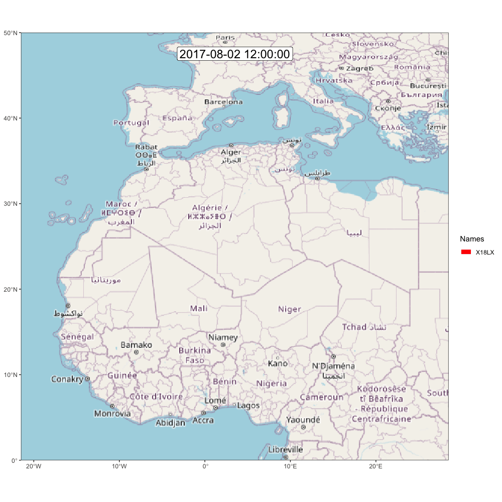

# Export and Visual

In this extra chapter we will see how to create some additional figure and export the data

## GeoPressureTemplate

-   [Basic Trajectory](https://raphaelnussbaumer.com/GeoPressureTemplate/basic_trajectory/18LX.html)
-   [Wind Trajectory](https://raphaelnussbaumer.com/GeoPressureTemplate/wind_trajectory/18LX.html)
-   [Basic Trajectory](https://raphaelnussbaumer.com/GeoPressureTemplate/basic_trajectory/18LX.html)

## [MoveVis](https://movevis.org/index.html)

Let's try to create some of the amazing visual trajectory from [MoveVis](https://movevis.org/index.html)

We'll need the `tag` structure to know the time and a path (lat, lon) which can come from any previously computed ones (simulations, shortes path, etc). Here we'll use the shortest path from the wind graph result

```{r}
load("data/1_pressure/18LX_pressure_prob.Rdata")
load("data/5_wind_graph/18LX_wind_graph.Rdata")
path <- shortest_path
```

Because the path encode the position during the entire stationary period, we need to produce a data.frame with the position at the start and end of each stationary period (i.e., thebird did not moved in between). We can do this with this function.

```{r}
df <- path2df(tag, path)
```

```{r, warning=FALSE}
frames <- df2move(df, CRS("+proj=longlat +ellps=WGS84 +datum=WGS84"),
             x = "lon", y = "lat", time = "time", track_id = "track_id") |> 
  align_move(res = 24, unit = "hours", digit = 12) |>  # Use midday position rather than midnight (while the bird could be flying)
  subset_move(from = tag$sta$end[1]-3*60*60*24, to = tail(tag$sta$start, 1)+0*60*60*24) |> # remove the long equipement and retrival period duration
  frames_spatial(equidistant = T, 
                 ext = extent(static_prob[[1]])) |> # 
  add_labels(x = NULL, y = NULL) |> # add some customizations, such as axis labels
  add_timestamps(type = "label", size = 6) |>
  add_progress()
```

It is worth checking what a frame looks like before generating the entire gif (taking around 10 min) with `frames[[100]]`. If you're satisfy, then, go for it!

```{r, eval=F}
animate_frames(frames, out_file = paste0("assets/movevis_18LX.gif"), height = 1000, width = 1000, overwrite = T)
```

And here is the map! Check out [moveVis examples for more idea](https://movevis.org/index.html#examples)

{width="50%"}
