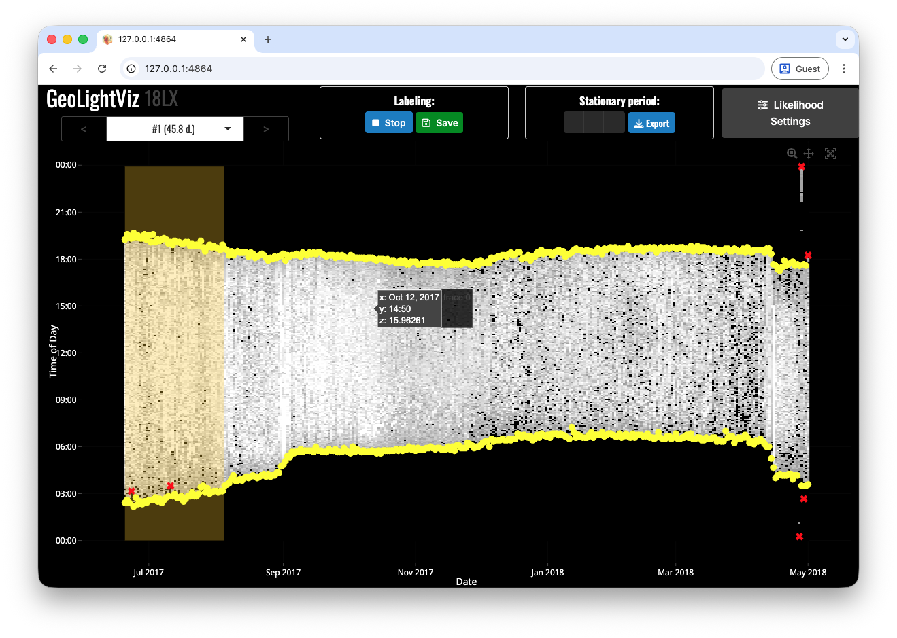
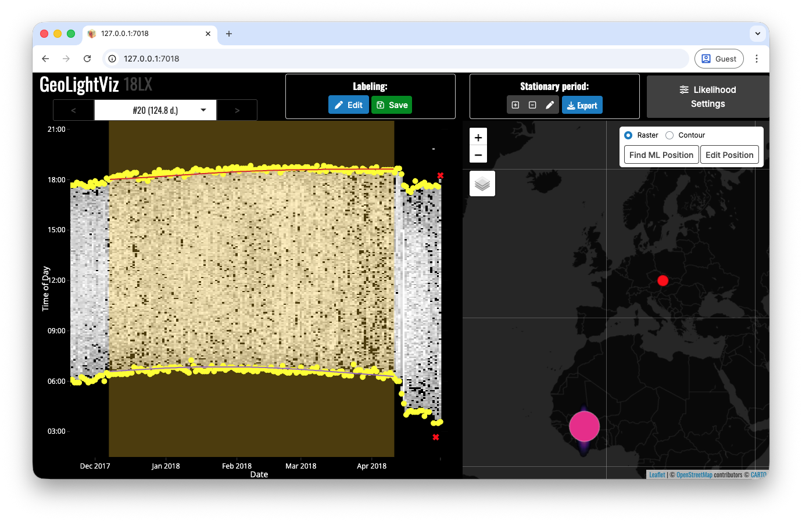

# GeoLightViz

```{r 08-geolightviz-setup}
#| message: false
library(GeoPressureR)
```

GeoPressureR includes the <a href="https://shiny.rstudio.com/" target="_blank">shiny app</a> `GeoLightViz`, designed to label twilight data and interactively tune light-based geolocation settings.

It is especially useful when pressure and/or acceleration are not available, because you can define and refine stationary periods directly from twilight patterns.

## Run GeoLightViz

Start the app with the `geolightviz()` function using either

```{r 08-geolightviz-run}
#| eval: false
geolightviz(tag) # tag object
geolightviz("18LX") #  interim file
geolightviz("data/twilight-label/18LX-labeled.csv") # the label file directly
```

By default, the app starts in a background R process (`run_bg = TRUE`), so your console remains available.

## Label Twilight

Start with twilight labelling before adjusting map or calibration settings.  
The left panel shows the light heatmap and extracted twilights (yellow dots).

1.  Click `Edit` to enter twilight-labelling mode.
2.  Mark outliers as `"discard"` by clicking points individually or drag-selecting multiple points.
3.  Click `Stop` when finished.
4.  Click `Save` (or `Export`) to write the label file.

When auto-save is available, the output is written to `data/twilight-label/{id}-labeled.csv`.

{width="100%" alt="GeoLightViz main interface showing twilight points on a light heatmap, stationary-period controls, and the map panel"}

## Define Stationary Periods

If pressure/acceleration are unavailable, you can define `stap` directly in GeoLightViz:

1.  Use `+` to add a stationary period by drawing a time rectangle on the light panel.
2.  Use `pen` to redraw the range of the currently selected stationary period.
3.  Use `-` to remove the current stationary period.
4.  Use the top selector (or `<` / `>`) to move across stationary periods.
5.  Click `Save` (or `Export`) to write the `stap` file.

When auto-save is available, the output is written to `data/stap-label/{id}.csv`.

## Map panel

The right map panel is shown only if:

1.  `tag_set_map()` has been run (map extent + scale are defined), and
2.  at least one stationary period is available.

When the map is available, the time and space views are linked:

1.  Selecting a stationary period updates both the highlighted time window (left) and the corresponding light likelihood map (right).
2.  `Edit Position` lets you click on the map to test candidate positions and immediately inspect the implied twilight lines in the left panel.
3.  `Find ML Position` sets the stationary-period location to the maximum-likelihood map position.

{width="100%" alt="GeoLightViz showing map-position editing with corresponding twilight-line updates on the light panel"}

## Adjust Twilight Calibration

Open `Likelihood Settings` to tune the two main light-map components:

1.  **Calibration smoothness** via `twl_calib_adjust`, with immediate visual diagnostics.
2.  **Twilight aggregation strength** (log-linear pooling factor) controlling how strongly multiple twilights are combined within each stationary period.

This is useful for sensitivity checks before running the full `geolight_map_*` workflow.

{width="100%" alt="GeoLightViz likelihood settings modal showing twilight calibration plot and aggregation parameter controls"}
