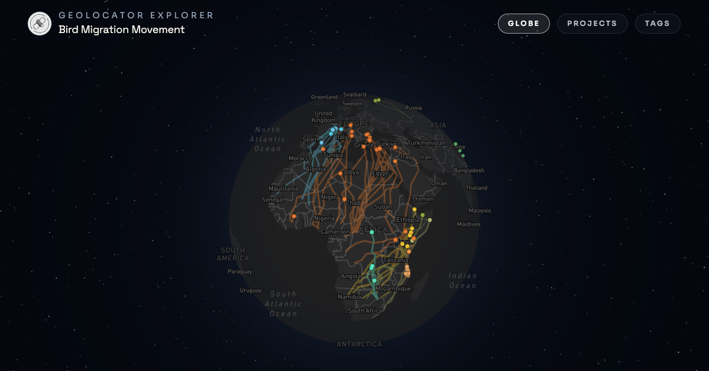

# Read and use

This tutorial shows how to discover, load, combine, and analyze published GeoLocator Data Packages.

```{r 16-setup}
#| message: false
#| code-fold: true
# library(GeoLocatoR)
devtools::load_all("~/Documents/GitHub/GeoLocatoR/")
library(GeoPressureR)
library(dplyr)
library(ggplot2)
library(lubridate)
library(stringr)

theme_geolocator_modern <- function(base_size = 12) {
  theme_minimal(base_size = base_size) +
    theme(
      plot.title.position = "plot",
      plot.title = element_text(
        face = "bold",
        size = base_size + 2,
        color = "#0f172a"
      ),
      plot.subtitle = element_text(size = base_size, color = "#475569"),
      axis.title = element_text(color = "#334155"),
      axis.text = element_text(color = "#475569"),
      panel.grid.minor = element_blank(),
      panel.grid.major = element_line(color = "#e2e8f0", linewidth = 0.35),
      panel.background = element_rect(fill = "#fcfdff", color = NA),
      plot.background = element_rect(fill = "white", color = NA),
      strip.background = element_rect(fill = "#f1f5f9", color = NA),
      strip.text = element_text(face = "bold", color = "#334155"),
      legend.title = element_text(face = "bold", color = "#0f172a"),
      legend.text = element_text(color = "#334155")
    )
}
```

## Discover datasets with GeoLocatorExplorer

Use the interactive [GeoLocatorExplorer](https://raphaelnussbaumer.com/GeoLocatorExplorer/) to find datasets you're interested in.

{width="100%" alt="Screenshot of GeoLocatorExplorer showing searchable geolocator data packages"}


## Read one GeoLocator Data Package

Records can be loaded using the Zenodo record id, DOI, DOI URL, or Zenodo record URL. This will automatically download the data, upgrade if necessary and load the data in your R console. 

```{r 16-read-gldp}
#| collapse: true
#| cache: true
pkg <- read_zenodo("https://zenodo.org/records/13829929")

print(pkg)

plot(pkg, "map")
```

A GeoLocator DP object gives direct access to tabular resources through accessor functions: `tags()`, `observations()`, `measurements()`, `staps()`, `paths()`, `edges()`, `twilights()`, and `pressurepaths()`. 

For instance, the following code computes the uncertainty in total distance flown for each bird (expressed as a percentage across simulations):

```{r 16-access-tables}
dist_sim <- edges(pkg) |>
  filter(type == "simulation") |>
  group_by(tag_id, j) |>
  summarise(total_distance = sum(distance), .groups = "drop")

dist_sim |>
  group_by(tag_id) |>
  summarise(
    uncertainty_pct = 100 * sd(total_distance) / mean(total_distance),
    .groups = "drop"
  ) |>
  rename(`Distance uncertainty (%)` = uncertainty_pct) |>
  knitr::kable(digits = 1)
```


## Merge multiple packages

You can combine two geolocator-dp objects with `merge_gldp()`. To make it easier, we can use `purrr` to read and combine a list of zenodo record_id into a single geolocator-dp object:

```{r 16-read-gldp-second}
#| message: false
#| cache: true
pkgs <- c("16730669", "17084708", "18311204", "13829929", "16804931") |>
  purrr::map(read_zenodo) |>
  purrr::reduce(merge_gldp)
```

::: callout-important
`merge_gldp()` returns a valid `geolocator-dp`, but it should be interpreted as a compiled object built from multiple source packages.

1. Tabular resources are merged by row.
2. Package-level metadata is merged with dedicated rules: some fields are combined (e.g., `contributors`), recomputed (e.g., `taxonomic`), while other are dropped (e.g., `id`).
3. `tags()` becomes the key provenance table: each tag has a `datapackage_id` that identifies its source datapackage.
4. A new table `pkgs$datapackages` is introduced and stores one row per source datapackage with compact provenance metadata and summary counts.
:::

## Showcase analysis: migration performance and wind support

This first example is a compact demonstration of table manipulation from a single resource (`edges()`), including data extract, filtering and mutation while asking a basic ecological question: "Are flights longer when wind support is better?"

```{r 16-build-edge-metrics}
#| code-fold: true
#| fig-width: 14
#| fig-height: 10
edge_metrics <- edges(pkgs) %>%
  filter(type == "most_likely") %>%
  left_join(tags(pkgs), by = "tag_id") %>%
  mutate(
    facet_label = paste0(
      str_replace_all(scientific_name, "\\b(\\w{1,3})\\w*", "\\1"),
      " (",
      tag_id,
      ")"
    ),
    duration_h = stap2duration(.),
    groundspeed = sqrt(gs_u^2 + gs_v^2),
    windspeed = sqrt(ws_u^2 + ws_v^2),
    wind_support = (gs_u * ws_u + gs_v * ws_v) / pmax(windspeed, 1e-6)
  ) %>%
  filter(!is.na(wind_support))

edge_metrics %>%
  ggplot(
    aes(
      x = distance,
      y = groundspeed,
      color = wind_support,
      size = duration_h
    )
  ) +
  geom_point(alpha = 0.72) +
  geom_smooth(
    aes(x = distance, y = groundspeed),
    method = "lm",
    se = FALSE,
    color = "#111827",
    linewidth = 0.55,
    inherit.aes = FALSE
  ) +
  facet_wrap(~facet_label, ncol = 8) +
  scale_color_gradient2(
    low = "#2563eb",
    mid = "#e2e8f0",
    high = "#dc2626",
    midpoint = 0,
    name = "Wind support\n(m/s)"
  ) +
  scale_size(range = c(1.2, 4.8), name = "Duration (h)") +
  labs(
    title = "Migration legs: distance, speed, and wind support",
    subtitle = "Flights tend to be longer and faster under stronger tailwind support",
    x = "Leg distance (km)",
    y = "Groundspeed (m/s)"
  ) +
  theme_geolocator_modern(base_size = 11) +
  theme(
    panel.spacing = grid::unit(0.55, "lines"),
    strip.text = element_text(size = 9),
    legend.position = "right"
  )
```

Across individuals, warmer colors (positive wind support) concentrate on larger/faster legs, showing that birds generally fly longer when wind support is better.

## Showcase analysis: latitude seasonality from staps

This second example demonstrates combining multiple resources with joins and filtering with the question of synchroneity of migration timing across different flyways crossing path in Southern Africa (< -4°).

```{r 16-build-daily-latitude}
#| code-fold: true
#| fig-width: 13
#| fig-height: 8
south_tag_ids <- paths(pkgs) %>%
  filter(type == "most_likely", !is.na(lat)) %>%
  group_by(tag_id) %>%
  summarize(min_lat = min(lat, na.rm = TRUE), .groups = "drop") %>%
  filter(min_lat <= -4) %>%
  pull(tag_id)

daily_latitude <- paths(pkgs) %>%
  filter(type == "most_likely", tag_id %in% south_tag_ids) %>%
  select(tag_id, stap_id, lat) %>%
  inner_join(
    staps(pkgs) %>% select(tag_id, stap_id, start, end),
    by = c("tag_id", "stap_id")
  ) %>%
  inner_join(
    tags(pkgs) %>% select(tag_id, scientific_name),
    by = "tag_id"
  ) %>%
  mutate(
    scientific_name = coalesce(scientific_name, "Unknown species"),
    start_day = as.Date(start, tz = "UTC"),
    end_day = as.Date(end - lubridate::seconds(1), tz = "UTC"),
    end_day = if_else(end_day < start_day, start_day, end_day)
  ) %>%
  mutate(date = purrr::map2(start_day, end_day, ~ seq(.x, .y, by = "day"))) %>%
  tidyr::unnest(date) %>%
  arrange(tag_id, date, stap_id) %>%
  distinct(tag_id, date, .keep_all = TRUE) %>%
  group_by(tag_id) %>%
  mutate(
    doy_norm = yday(date),
    new_segment = row_number() == 1L |
      doy_norm < lag(doy_norm, default = first(doy_norm)),
    segment_id = cumsum(new_segment)
  ) %>%
  ungroup()

species_levels <- daily_latitude %>%
  distinct(scientific_name) %>%
  arrange(scientific_name) %>%
  pull(scientific_name)

species_palette <- setNames(
  grDevices::hcl.colors(length(species_levels), palette = "Dark 3"),
  species_levels
)

daily_latitude %>%
  ggplot(
    aes(
      x = doy_norm,
      y = lat,
      color = scientific_name,
      group = interaction(tag_id, segment_id, drop = TRUE)
    )
  ) +
  geom_hline(
    yintercept = 0,
    color = "#94a3b8",
    linewidth = 0.4,
    linetype = "dashed"
  ) +
  geom_line(alpha = 0.62, linewidth = 0.9, lineend = "round") +
  scale_color_manual(values = species_palette) +
  scale_x_continuous(
    limits = c(1, 366),
    breaks = c(1, 32, 60, 91, 121, 152, 182, 213, 244, 274, 305, 335),
    labels = month.abb,
    expand = expansion(mult = c(0.01, 0.01))
  ) +
  labs(
    title = "Latitude by normalized day of year",
    subtitle = "Most-likely paths reaching south of -4 degrees latitude; expanded to one position per day from staps",
    x = "Normalized day of year",
    y = "Latitude (degrees)",
    color = "Scientific name"
  ) +
  guides(
    color = guide_legend(
      nrow = 2,
      byrow = TRUE,
      override.aes = list(alpha = 1, linewidth = 2)
    )
  ) +
  theme_geolocator_modern(base_size = 12) +
  theme(
    legend.position = "bottom",
    legend.title.position = "top",
    legend.box = "horizontal"
  )
```

This seasonal plot highlights strong synchronicity in migration timing across distinct African flyways, and reveals two autumn migration windows that can extend into early January.

## Reuse in GeoPressureTemplate

If a package has not yet been analysed with GeoPressureR, you can bootstrap a GeoPressureTemplate project from it.

```{r 16-create-template-from-pkg}
#| eval: false
create_geopressuretemplate(path = "~/Documents/woodlandkingfisher", pkg = pkg)
```
