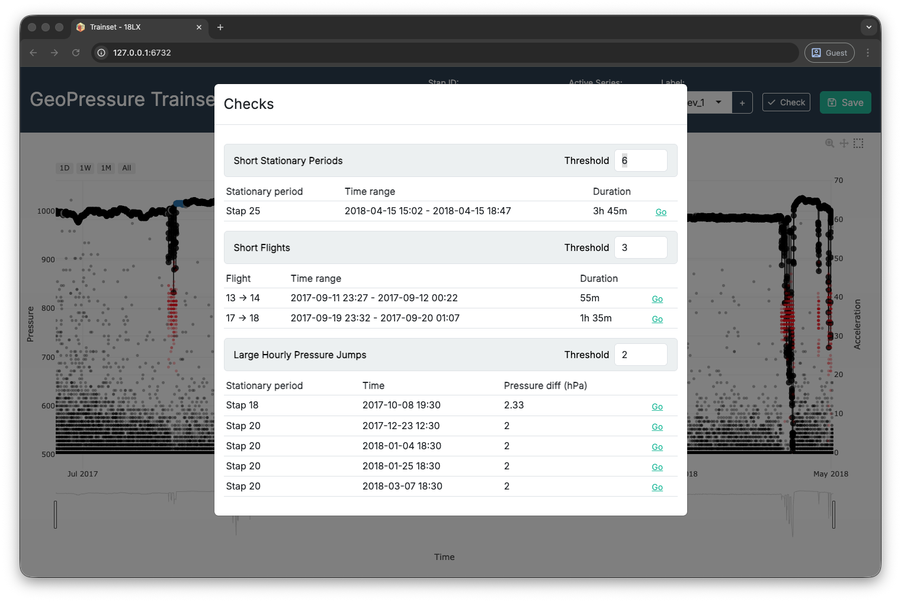

# Labelling tracks {#sec-labelling-tracks}

```{r 08-setup}
#| message: false
library(GeoPressureR)
```

In this final chapter, you will finally learn how to label your tag. Labelling is a relatively long **iterative process**: you repeatedly refine the label csv file in the `trainset` Shiny app until all validity checks pass. You can expect to spend between 1 minutes to 60 minutes per track, depending on the species' complexity, and likely more for the first track you label. The more you label, the faster it will get! 


::: callout-important
This chapter assumes that you are familiar with the overall process of GeoPressureR presented in the [Basic tutorial](tag-object.html), as well as the concept of [PressurePath](pressurepath.html) and the use of [GeoPressureViz](geopressureviz.html).
:::

## Labelling principles

Labelling your tracks is imperative because GeoPressureR requires highly precise and well-defined pressure timeseries of a fixed/constant location both horizontally (geographical: +/- 10-50km) and vertically (altitude: +/- 2m).

The procedure involves labelling each datapoint (1) with the `flight` label when the bird is in active migratory flight, (2) with the `discard` label for pressure datapoints that should be discarded from the matching exercise and (3) with `elev_*` for continued changed of altitude within a stap. The overall objective is to create a pressure timeseries for each stationary period where the bird can be assumed to remain at the same location and elevation during the entire period.

1. **Labelling `flight` defines stationary periods and flight duration**. A stationary period is a period during which the bird is considered static relative to the size of the grid (\~10-50km). The start and end of the stationary period is used to define the pressure timeseries to be matched. Having an accurate flight duration is critical to correctly estimate the distance traveled by the bird between two stationary periods.

2. **Labelling `discard` eliminates vertical (altitudinal) movements of the bird.** The algorithm matching the pressure timeseries is sensitive to small pressure variations of a few hPa, such that even altitudinal movements of a couple of meters can throw off the estimation map for short stationary periods. Since the reanalysis data to be matched is provided at a single pressure level, we must discard all datapoints corresponding to a different elevation.

3. **Labelling stapelev with `elev_*` accounts for changes in altitude within a single stationary period.** This more advenced labeling technique is introduced in section [Elevation period](#elevation-period).

Each species' migration behaviour is so specific that **manual editing remains the fastest option**. Indeed, small changes in pressure and activity can correspond to either local movement or slow migration. Expertise on your bird's expected migration style will be essential to correctly label your tracks. As you label, you will learn how the bird is moving (e.g. long continuous high altitude flights, short flights over multiple days, alternation between short migration flights and stopovers, etc.). Manual editing also gives a sense of the uncertainty of your labelling, which is useful to interpret your results.

## With or without acceleration data?

Acceleration data can significantly improve our understanding of bird activity and movement. It's often very helpful for the labeling flights, and even essential for some specie. For instance, acceleration data is the only way to idenfy low-altitude migration flight. In addition, acceleration is typically recorded at a higher temporal resolution (5min), which can refine flight duration and thus the movement model when building the trajectory.

::: callout-warning
## Which timeseries should I label?

When acceleration data is available, use the `flight` label on the acceleration timeseries, and the `discard` label on the pressure timeseries.

In the absence of acceleration data, both labels are applied to the pressure timeseries.
:::

Acceleration data can be used to initialize the `flight` label automatically. This step is done automatically when no label exist when starting `trainset()` but you can also refine the paramater manually using `tag_label_auto()`. 

## Introduction to TRAINSET

Start labeling using the `trainset()` function:

```{r 08-labelling-process-pseudo-code} 
#| eval: false
trainset("data/tag-label/18LX-label.csv")

# or using a tag obeject
trainset(tag)
```


{width="100%" alt="TRAINSET interface showing labelled pressure timeseries with red flight periods and gray discard periods"}

**A few tips:**

- **Keyboard shortcuts** can considerably speed up navigation. Click the info button for more information.
- Use the information from **both timeseries** (pressure and acceleration) at the same time to help you determine what the bird might be doing.
- **Adapt the y-axis range** to see the small (but essential) pressure variations which are not visible in the full view.


::: callout-note
## Why TRAINSET?

<a href="https://trainset.raphaelnussbaumer.com/" target="_blank">TRAINSET</a> was the original web platform used for labelling. It was built as a customization of the <a href="https://trainset.geocene.com/" target="_blank">Geocene TRAINSET app</a>, a web-based tool for time-series annotation.

The legacy website is still online, but it is now deprecated. We recommend using the `trainset()` Shiny app integrated in `GeoPressureR` (from v3.5.0), which is better maintained and fits the GeoPressure workflow more directly.
:::


## Elevation period

It is common for birds to change elevation level within the same stationary period (e.g., roost vs feeding site or altitudinal movements for mountainous species). Such movements can result in drastic variations in pressure, which interfere with the ERA5 matching exercise.

To circumvent this issue while preserving as much data as possible in the match, you can label pressure data with different **elevation levels** by using `elev_x` in TRAINSET. To do so, click on the + sign in the label selector to create a new elevation level (e.g., `elev_1`). Assign the new label to all pressure datapoints belonging to the same elevation period. 

- **Note 1:** Conseptually, you can think of unlabelled datapoints (i.e., black dots) as `elev_0`.
- **Note 2:** The elevation levels do not have to be continuous: it's even better if the same elevation period comes back several times during the same stationary period. For instance, you can have unlabelled datapoints for the feeding site every day and labelled datapoints at the roosting location of every night as `elev_1`.
- **Note 3:** You can restart the count of `elev_x` for each new stationary period (e.g., the datapoints from stap 1 labelled as `elev_1` are not connected to the datapoints from stap 2 also labelled as `elev_1`).
- **Note 4:** In general, short elev level (< 12-24h) might be better left out (i.e, discard) to reduce computational/memory cost, especially, if you have long eleve level on the same stap. But see note 5.
- **Note 5:** It's ideal to have the highest and lowest elevation included as they can bring tromendous constrains on the elevation mask of the likelihood map. 

{width="100%" alt="TRAINSET interface showing elevation-period labelling with elev_x markers within stationary periods"}

## Trainset checks

Use the `Check` button in TRAINSET as a quick quality-control panel. The modal highlights three common issues:

1.  **Short stationary periods**: often a sign of fragmented or misplaced flight labels.
2.  **Short flights**: often accidental flight labels or noisy transitions.
3.  **Large hourly pressure jumps**: often outliers, label mistakes, or artefacts inside a stationary block.

Each section has its own threshold in the header. You can change thresholds live to be more strict or permissive.

Use the `Go` button on each warning row to jump directly to the relevant period/time window, inspect, relabel, and re-check.

::: callout-warning
## How strict should thresholds be?

There is no universal threshold that fits all tags and species. Warnings are prompts for manual review, not automatic errors.

A few short stationary periods or flights can be acceptable, but too many often indicate over-fragmentation and can slow down downstream workflows.
:::

{width="100%" alt="TRAINSET interface showing elevation-period labelling with elev_x markers within stationary periods"}

## GeoPressureViz check

At this stage, the label file should be good enough to start estimating the position of the bird. This will be super helpful to then compare the pressure measurements to the ERA5 pressure and refine the labelling. To help in this process, we'll be using [GeoPressureViz](geopressureviz.html).

Before this, we need to compute the likelihood maps. It's generally better to start from scratch to be sure everything is working fine:

```{r 08-full-workflow}
#| eval: false
# Use the geopressuretemplate to run a full clean tag
geopressuretemplate_tag("18LX")

# Open geopressureviz directly with the interim
geopressureviz("18LX")
```

In GeoPressureViz, your main task is to draw a coherent trajectory with the following steps:

1. Toggle the “Full Track” button to be in the stationary period view
1. "Edit position" of the stationary periods to be coherent.
2. "Query pressure" to retrieve the ERA5 pressure at this position
3. Compare the ERA5 pressure to the tag pressure in the bottom panel
4. Refine the label in TRAINSET accordingly: (1) Modify flight duration with `flight`, (2) label pressure outliers with `discard`,  (3) use stapelev with `elev_x` label or even (4) merge or split stationary periods

::: callout-warning
## What do you mean by "drawing" a coherent trajectory?

To make sure that the labelling is correctly performed, you should be able to manually edit the position of the trajectory so that (1) the distance between consecutive stationary periods matches the flight duration (i.e., dots following on the circles) and (2) the pressure measurements match the ERA5 pressure at this location (i.e., high likelihood value on the map).

Note that the initial path shown on GeoPressureViz is likely not realistic as no movement model has been included (i.e., no limitation on bird flight duration). This is fine at this stage: we don't really want to assume a realistic path, just to see what pressure can tell us without assuming anything. Using this path, we can retrieve the ERA5 pressure along this path,
:::

::: callout-tip
## What to do when there is mismatch between ERA5 and tag pressure?

Mismatches between the geolocator and ERA5 are usually indicative of altitudinal movement of the bird. Depending on the situation, there are multiple ways to label this mismatch.

- In the easiest case, the bird simply flew within the same stationary site (\<10-50km) for a short time and came back to the same location. In this case, you can simply discard the pressure timeseries during the temporary change of altitude.
- If the bird changes altitude but never comes back to the same elevation, you can either consider that the new altitude is a new stationary period and label the activity data, or you can discard the timeseries of the shorter period. It is essential that the resulting timeseries matches the ERA5 pressure everywhere. Matches are usually better for longer periods. Looking at activity data for the same period can also help understand what the bird is doing.
- If the bird changes back and forth between two elevation levels, use the `elev_x` label to label them accordingly.

As a general guideline, it is better to remove a bit more for long stationary periods to get a better estimation of the position. You can do this iteratively by removing a bit and seeing whether the position improves as a result.
::: 

The main advantages of using [GeoPressureViz](geopressureviz.html) are:

- Only query the ERA5 pressure for stationary periods that need to be checked
- Compare the ERA5 pressure for different positions
- Separate the likelihood of pressure (mask and mismatch) and light as well as flight duration to see where they agree/disagree
- Filter out short stationary periods to see if they are coherent, before refining the trajectory by adding the shorter ones


## Pressurepath check

A final check should be performed on the pressurepath computed from your most likely trajectory.

We want to look at the histogram of the pressure error between geolocator and ERA5 timeseries for each stapelev.

```{r 08-pressurepath-check}
#| warning: false
load_interim("18LX")
plot_pressurepath(pressurepath, type = "hist", plot_plotly = FALSE)
```

- For long stationary periods (over 5 days), you want to check that there is a single [mode](https://en.wikipedia.org/wiki/Mode_(statistics)) in your distribution. Two modes indicate that the bird is spending time at two different altitudes. - This is usual when birds have a day site and a night roost at different elevations. In such cases, use the `elev_x` label.
- The red vertical dotted line indicates +/-3 sd which can be helpful to identify potential outliers.
- Stationary periods which have an empirical sd greater than the one used (`sd`) are highlighted in red. The likelihood map for these stationary periods might not be correct.

::: callout-note
## How to calibrate `sd`?

The conversion of the mean squared error (MSE) into a likelihood performed by `geopressure_map_likelihood()` assumes that the error distribution of pressure is normally distributed. This has important consequences in that it does not perform well in the presence of large errors, typically resulting in a map with a single possible pixel.

As mentioned in [Pressure map](pressure-map.html), `sd` should be adjusted to your own data. You can use the empirical `sd` value displayed on the histogram to guide you in setting the standard deviation parameter `sd` in `geopressure_map()`.

Note that you can use a different `sd` value to account for stationary periods with high altitudinal variation (e.g., mountainous areas), while keeping a low `sd` value when the bird is in a low-topography area.

In this case, an `sd=1` (default value) seems adequate, though `0.8` or `0.9` might offer more precision positioning.
:::

::: callout-info
This check should also be repeated at the very end of the [GeoPressureR workflow](geopressuretemplate-workflow.html) with the most likely trajectory and the associated pressurepath.

In addition, a last check with GeoPressureViz is highly recommended to see the difference between the likelihood maps and the marginal map. Remember that [models are only as good as the data provided](https://en.wikipedia.org/wiki/Garbage_in,_garbage_out)!

:::
