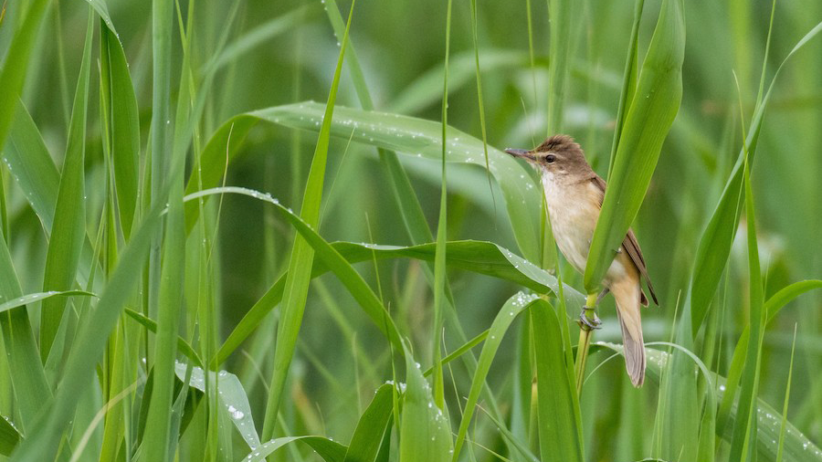

# Light map

```{r 04-setup}
#| message: false
library(GeoPressureR)
```

In the advanced tutorial, we construct the same three products with a Great Reed Warbler (18LX), this time including light and wind data.

{width="100%" alt="Photo of a Great Reed Warbler, a medium-sized brownish bird with streaked plumage, clinging to reed stems"}

This first chapter focuses on constructing a likelihood map from light data. This step is optional in the workflow, but can be helpful in most case. Typically, it is quite informative for short stopovers with long flights before and after. It can also be helpful to cross-check pressure map can reduce the computational cost of the creation of the graph.

Here, we use an approach based on the threshold method and using a calibration of zenith angle (rather than time of sunrise). This approach is presented in more detail in <a href="https://besjournals.onlinelibrary.wiley.com/doi/10.1111/2041-210X.14043#mee314043-sec-0008-title" target="_blank">section 2.4</a> of @Nussbaumer2023a.

A more thorough introduction to geolocation with light data can be found in <a href="https://geolocationmanual.vogelwarte.ch/" target="_blank">the geolocation manual</a> [@Lisovski2020]. Note that other methods producing likelihood maps could also be used such as the ones presented in @Basson2016 or @Bindoff2018.

## Basic tutorial catch up

Before getting into light data, we first need to create, label, and set the map for the `tag` object. We essentially perform the same steps than in [Tag object](tag-object.html) and [Pressure map](pressure-map.html) in just a few lines using the native pipe operator `|>`. Note that this assumes the labelling has already been done.

```{r 04-tag-geopressure-create}
#| cache: true
tag <- tag_create(
  "18LX",
  crop_start = "2017-06-20",
  crop_end = "2018-05-02",
  quiet = TRUE
) |>
  tag_label(quiet = TRUE) |>
  tag_set_map(
    extent = c(-16, 23, 0, 50),
    scale = 4,
    known = data.frame(
      stap_id = 1,
      known_lat = 48.9,
      known_lon = 17.05
    )
  ) |>
  geopressure_map(quiet = TRUE)
```

## Estimate twilights

We find the twilight (time of sunrise and sunset every day) with `twilight_create()`, which performs the same tasks as [`TwGeos::FindTwilight()`](https://rdrr.io/github/slisovski/TwGeos/man/findTwilights.html), but using a matrix representation. This approach is faster but possibly less general.

By default, the threshold of light `twl_thr` is automatically defined as the first and last light of the day (i.e., `tag$light$value>0`). The `twl_offset` parameter is used to centre the night/day for the matrix representation of light. A good centring is necessary to find the correct twilights.

```{r 04-twilight-create}
tag <- twilight_create(tag, twl_thr = NULL, twl_offset = NULL)
```

We can visualize the twilight and check the centering of the day.

```{r 04-twilight-plot}
plot(tag, type = "twilight")
```

Re-run `twilight_create` with a different `twl_offset` until the night/day is properly centred.

Because we have already label the stationary period before, the plot indicates which stationary period the twilight belongs to with the dot color. This can be useful to distinguish outliers from a change in the bird position.

## Manual labelling of twilight

Twilight outliers should be discarded from the analysis using the GeoLightViz shiny app included in GeoPressureR. See the [GeoLightViz chapter](geolightviz.html) for a full overview of all controls and workflows.

```{r 04-twilight-label-viz}
#| eval: false
geolightviz(tag)
```

::: callout-note
## How to pick out outliers?

Twilight outliers can be picked out visually when they don't follow a smooth line.

The color of the dots indicative of the stationary period can be helpful to pick out outliers from a change in the bird's position: while changes in twilight within a stationary period should be smooth, changes between positions can be abrupt.

Note that modifying the label of twilight to a different stationary period has no influence later on, as only `"discard"` labels are read with `twilight_label_read()`.

**Avoid Over-edit the calibration period.** The variability of twilight is important to build a calibration which adequately captures the range of uncertainty of a twilight. As it is easier to pick out outliers during long stationary periods (calibration period) than during shorter ones, there is a risk of having more variability during short stationary periods and thus biases in the estimated position.
:::

When you have finished labelling, read and check the twilight annotation.

```{r 04-twilight-label-read}
tag <- twilight_label_read(tag)
plot(tag, type = "twilight")
```

## Compute likelihood map

The light likelihood map is now built in three explicit steps:

1.  Calibrate twilight error in zenith angle with `geolight_map_calibrate()`.
2.  Compute one likelihood map per twilight with `geolight_map_likelihood()`.
3.  Aggregate twilight maps by stationary period with `geolight_map_aggregate()`.

```{r 04-map-light-calibrate}
tag <- geolight_map_calibrate(
  tag,
  twl_calib_adjust = 1.4,
  fitted_location_duration = Inf,
  quiet = TRUE
)
```

Set `fitted_location_duration` to a finite value (e.g. `5`) if you want GeoPressureR to estimate a calibration location from long stationary period(s) instead of relying only on known coordinates.

The `twl_calib_adjust` parameter controls the smoothness of the calibration density (`stats::density()`). Since calibration is estimated from calibration site(s) and then applied across the full trajectory, it is generally safer to use a slightly broader fit (`twl_calib_adjust > 1`).

::: callout-note
## About `fitted_location_duration`

`fitted_location_duration` defines the minimum stationary-period duration (in days) eligible for automatic calibration-location fitting.

- `Inf` (default): no automatic fitting, calibration uses only known location(s) from `tag_set_map(known = ...)`.
- Finite value (e.g. `5`): GeoPressureR searches for stationary period(s) at least that long, fits location(s) from twilight, and uses them as calibration locations.

Use this when no reliable known calibration site is available, or to complement sparse known locations.
:::

You should always check calibration before computing the map:

```{r 04-twilight-calibration-plot}
plot_twl_calib(tag)
```

You can also compare the calibration against a provisional path:

```{r 04-twilight-calibration-plot-path}
plot_twl_calib(tag, path = tag2path(tag, interp = 2))
```

This diagnostic shows, for each stationary period, the distribution of observed twilight zenith angles along the provisional path, overlaid with the calibrated distribution. Stationary periods highlighted as out-of-range suggest potential issues with twilight labels, calibration settings, or the provisional path itself. Use this plot iteratively to refine labels and calibration before final trajectory modelling.

We can now compute a likelihood map for each individual twilight event. These per-twilight maps are stored in `tag$map_light_twl` and are the raw inputs for the stationary-period aggregation step.

With `compute_known = FALSE`, twilight maps are not computed for stationary periods with known coordinates (they are handled later as fixed known locations).

```{r 04-map-light-likelihood}
tag <- geolight_map_likelihood(
  tag,
  compute_known = FALSE,
  quiet = TRUE
)
```

Next, we aggregate twilight maps within each stationary period using log-linear pooling (`twl_llp`).

The function `\(n) log(n) / n` down-weights each twilight contribution as the number of twilights (`n`) increases, which helps limit overconfidence when twilight errors are temporally correlated.

The output of this step is `tag$map_light`, which is the map used in the rest of the trajectory workflow.

```{r 04-map-light-aggregate}
tag <- geolight_map_aggregate(
  tag,
  twl_llp = \(n) log(n) / n,
  compute_known = FALSE,
  quiet = TRUE
)
```

Finally, we can visualize the aggregated probability map for each stationary period:

```{r 04-map-light-plot}
#| warning: false
plot(tag, type = "map_light")
```

`geolight_map()` is a shortcut that runs these three steps in sequence.

::: {.callout-warning style="margin-top: 20px;"}
## Light map vs pressure map?

It is worth checking how the likelihood map of light and pressure compare before building the graph. They should always overlap. If this is not the case, the tag and/or twilight labelling needs to be adjusted.

This task is best performed with GeoPressureViz, presented in [its dedicated chapter](geopressureviz.html). For now, we can simply visualize the resulting likelihood map of pressure and light combine.

```{r 04-map-pressure-light-plot}
#| warning: false
plot(tag, type = "map")
```

:::

## Check light label

In the same way that pressure label needs to be checked, light label can also be checked. The idea is to compute the estimated trajectory, compute the twilights along this trajectory and compare the empirical twilight measured/computed above. We use here `tag2path()` which computes the most likely position for each stationary period (i.e. regardless of flight duration/movement model). We interpolate each position below 2 days to avoid unrealistic position estimates.

```{r 04-path-from-tag}
#| warning: false
path <- tag2path(tag, interp = 2)
```

This path can be visualized with `plot_path(path)`

We can compute the theoretical twilights which should be observed by a bird on this path using `path2twilight()`

```{r 04-path-twilight-theoretical}
twilight_line <- path2twilight(path)
```

This theoretical twilight can be compared to the empirical one using the `plot_tag_twilight()`

```{r 04-twilight-compare}
plot_tag_twilight(tag, twilight_line = twilight_line, plot_plotly = T)
```
